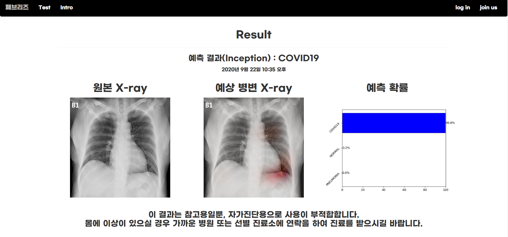

# CXR(흉부 X-ray) 이미지와 딥러닝을 이용하여 COVID-19 분류

 

팀명: 폐브리즈

팀원: 김진혁, 김주연, 양시영, 정진균, 최준범

 

### Repository

1. DATA
   - 딥러닝 학습에 사용된 이미지
2. ML
   - 딥러닝 모델에 대한 내용
3. WEB
   - Django를 이용해서 웹 구현

 

### URL

- [폐브리즈](https://jinhyuk.kim/)

 

### WEB 이미지

-------------------

 

--------------

  

--------------

  

--------------

  

